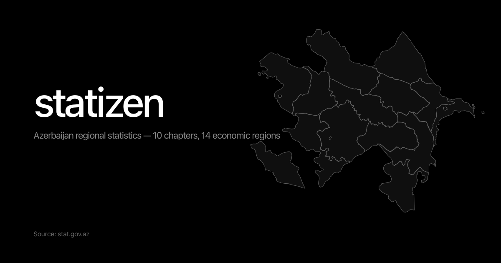

# Statizen

Interactive map of Azerbaijan's labour statistics by economic region.
Single-page, dark, full-bleed. Source data: **stat.gov.az**.



## What it is

Hover or tap a region on the map (or pick one from the list/dropdown), pick
an indicator, see the value. Mobile users drag to pan the map. EN/AZ
language toggle in the header. Selected views are shareable —
`?region=&indicator=&lang=` is preserved in the URL.

## Stack

- Next.js 15 (App Router, **static export** → `output: "export"`)
- TypeScript strict, Tailwind v4
- Archivo variable font (next/font), framer-motion (parallax + drag + spring)
- Zustand store + `history.replaceState` URL sync (no router middleware
  required, static-export-safe)
- Custom SVG map — geometry from Figma vectors, **no `d3-geo`** (the
  geometry is design-space, not geographic). 14 economic regions, fit-to-
  region zoom on select.

## Data

| Indicator | Source file | Coverage |
|---|---|---|
| Labour force | stat.gov.az `009_1en.xls` | 2015–2024 |
| Employed population | `009_2en.xls` | 2015–2024 |
| Unemployment rate (%) | `009_3-4en.xls` (sheet `9.4`) | 2015–2024 |
| Number of employees | `009_5en.xls` | 2015–2024 |
| Average monthly nominal wage (manat) | `009_6en.xls` | 2015–2024 |
| Registered unemployed | `009_7en.xls` | 2015–2019, 2023–2024 |
| Unemployment insurance recipients | `009_8en.xls` | 2015–2024 |

Region model = the **14 economic regions** per the 2021 decree (exactly
what stat.gov.az publishes). Built by the Python ETL in `etl/` — see
`etl/build.py`. Every number traces to a specific source file + year, no
estimates, no smoothing.

## Develop

```bash
npm install
npm run dev          # http://localhost:3000
npm run build        # static export -> ./out
```

## Refresh data

```bash
# in /etl
python download.py   # fetch the 14 .xls files from stat.gov.az
python build.py      # parse, validate, write /data/*.json
```

If stat.gov.az publishes new years, just re-run the two commands and rebuild.

## Source attribution

All region-level data: State Statistical Committee of the Republic of
Azerbaijan — <https://www.stat.gov.az/source/labour/?lang=en>.

This site doesn't add analysis — it makes existing official statistics
legible.
